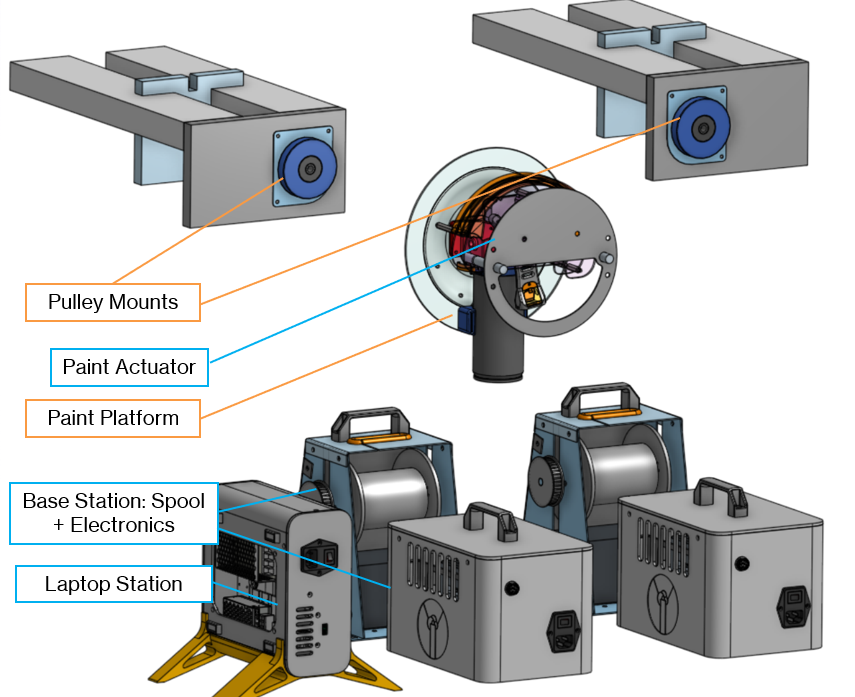

# Muraline: Automated Mural Sketching Assistant

  

**Muraline is an automated, cable-driven robot system designed to assist artists in transferring digital artwork onto large physical surfaces, streamlining the "blocking out" phase of mural creation.**

---

## Table of Contents

- [The Problem: Blocking Out Large Murals](#the-problem-blocking-out-large-murals)
- [Our Solution: Muraline](#our-solution-muraline)
- [Key Features](#key-features)
- [How It Works (Artist Workflow)](#how-it-works-artist-workflow)
- [System Overview](#system-overview)
  - [Hardware](#hardware)
  - [Software (UI & Backend)](#software-ui--backend)
  - [Firmware](#firmware)
- [Technology Stack](#technology-stack)
- [Testing & Validation](#testing--validation)
- [Future Iterations](#future-iterations)
- [Project Motivation](#project-motivation)
- [Acknowledgements](#acknowledgements)

---

## The Problem: Blocking Out Large Murals

Creating large-scale murals often begins with a technically challenging, time-consuming, and potentially expensive process called "blocking out." This involves accurately scaling and outlining the artist's design onto the wall.

Traditional methods like projection are difficult for large or sunlit walls, while techniques like the "Squiggle Grid" are labor-intensive, require extended scaffolding/lift rentals, and can disrupt local businesses. This initial phase demands high technical skill but offers low creative output, posing barriers for both amateur and professional artists.

  
  The traditional 'blocking' process can be complex

## Our Solution: Muraline

Muraline tackles the blocking-out challenge head-on. It's a portable, automated system that precisely sketches the major outlines of an artist's digital design onto a wall using spray paint.

**Crucially, Muraline does *not* replace the artist.** It automates the tedious outlining step, freeing artists to focus on the creative execution – adding color, detail, and their unique touch. Muraline aims to:

*   **Reduce Skill Barrier:** Makes large-scale murals more accessible to emerging artists.
*   **Reduce Time Barrier:** Significantly cuts down setup and outlining time for professionals.
*   **Lower Costs:** Minimizes the need for prolonged lift/scaffolding rentals.

## Key Features

*   **Automated Sketching:** Precisely translates digital vector outlines (`SVG`) into physical spray-painted sketches.
*   **Digital Workflow Integration:** Accepts standard `SVG` files from common design software (Illustrator, Inkscape, etc.).
*   **Artist-Centric UI:** Intuitive Java-based interface for loading, scaling, positioning, and previewing artwork on the virtual wall.
*   **Scalable & Portable:** Designed for various wall sizes with modular, easily transportable hardware components.
*   **Optimized Path Planning:** Uses curved Bezier transitions between segments for smoother motion and cleaner lines, minimizing stops and overspray.
*   **Real-time Control:** Features include pause/resume, step-by-step execution, and manual jogging.
*   **Customizable Output:** Allows filtering of small details and configuration of painting parameters.

   
  <!-- Adjust width as needed -->
  The Muraline User Interface

## How It Works (Artist Workflow)

Muraline simplifies the initial mural stages into a clear workflow:

1.  **Create Digital Sketch:** Artist designs their mural in any drawing software and exports the key outlines as an `SVG` file.
2.  **Configure & Upload:** Artist sets up the Muraline hardware (pulleys, base stations), measures the wall, and uses the Muraline software UI to:
    *   Upload the `SVG` file.
    *   Scale and position the artwork onto the virtual wall dimensions.
    *   Preview the robot's toolpath.
    *   Adjust parameters (speed, scale factor).
3.  **Robot Sketches Outline:** Muraline's cable robot autonomously sketches the processed outlines onto the physical wall using a spray paint actuator.
4.  **Artist Completes Mural:** With the accurate outlines in place, the artist takes over creatively, completing the mural with colors, shading, and details.

## System Overview

### Hardware

Muraline employs a two-wire, cable-driven robot (Polargraph) architecture. Key components include:

*   **Base Stations:** Ground-based units housing NEMA 34 stepper motors, custom spools with Kevlar wire, timing belt reductions, and motor control electronics. Designed for stability and power.
*   **Paint Platform:** The lightweight end-effector holding the spray paint can. Features a custom paint actuator mechanism, skid plate for smooth wall contact, and precisely positioned cable attachment points ("clock hands") for stability.
*   **Pulley Mounts:** Simple clamps holding pulleys, mounted at the top corners of the work area to guide the Kevlar wires.
*   **Laptop Station:** Houses the main control board (BTT SKR V1.3), power supplies (12V, 5V), LCD interface, and connections to the Base Stations and Paint Platform.

  
  Overview of the Muraline hardware components

### Software (UI & Backend)

*   **User Interface (UI):** A custom desktop application developed in **Java** using the **Processing** framework. Provides intuitive controls for artists:
    *   `SVG` file loading and parsing.
    *   Interactive scaling, rotation, and positioning.
    *   Visual preview of toolpaths (drawing and travel moves).
    *   Parameter adjustment (speed, scale, line filtering).
    *   Real-time connection status and control (Home, Plot, Pause, Step, Manual Jog).
    *   Terminal output for diagnostics.
*   **Backend:** Handles the computational tasks:
    *   Parameterized `SVG` parsing to extract path data.
    *   Curved travel pathing (Bezier curves) for smooth transitions between drawing segments.
    *   Procedural `G-code` generation tailored for the Polargraph kinematics and Marlin firmware.

  
  High-level software and firmware architecture

### Firmware

*   **Platform:** Runs on a customized fork of the open-source **Marlin Firmware**.
*   **Hardware:** BTT SKR V1.3 microcontroller board.
*   **Functionality:**
    *   Interprets the custom `G-code` generated by the Muraline software.
    *   Manages **Polargraph kinematics**, translating desired XY coordinates into specific instructions for the two base station stepper motors.
    *   Controls motor acceleration and velocity profiles for smooth and precise movement.
    *   Handles communication with the host software via USB.
    *   Controls the paint actuator servo via PWM signals.

## Technology Stack

*   **Firmware:** C++ (Marlin Fork)
*   **Control Software/UI:** Java (Processing IDE)
*   **Microcontroller:** BTT SKR V1.3
*   **Motors:** NEMA 34 Stepper Motors (Base Stations), High-Strength Servo (Paint Actuator)
*   **Input Format:** SVG (Scalable Vector Graphics)
*   **Machine Code:** G-code (Customized)

## Testing & Validation

Muraline underwent rigorous testing:

*   **Paint Application:** Optimized spray distance, speed (0.3 m/s), acceleration (1.5 m/s²), cap types, and actuation using a dedicated test rig.
*   **System Accuracy & Repeatability:** Successfully reproduced complex geometric patterns and repeated outlines with high fidelity on a 7x8 ft test wall.
*   **Real-World Artist Collaboration:** Collaborated with an IGEN student artist (Rachel Hogg) to translate her digital artwork into a physical sketch, validating the intended workflow.
*   **Large-Scale Testing:** Demonstrated motion capabilities and stability on a 4-storey parkade wall (approx. 10x8m work area), confirming scalability.

  
  Painted geometric and repeatability test patterns

  
  Muraline's outline (left) based on Rachel Hogg's digital art, and her final painted mural (right)

  
  Testing system motion at scale on a 4-storey wall

## Future Iterations

Potential improvements identified for future development:

*   **Wall Scanning:** Automatic mapping of the wall surface and dimensions.
*   **Closed-Loop Control:** Using encoders for improved motor accuracy and error detection.
*   **Obstacle Avoidance:** Active thrust-based system to navigate around minor wall obstructions.
*   **Automatic/Scheduled Homing:** Simplified calibration process.
*   **Live Camera Feed:** For remote monitoring of the painting process.
*   **Improved Data Transmission:** Exploring Powerline or wireless protocols for greater bandwidth.